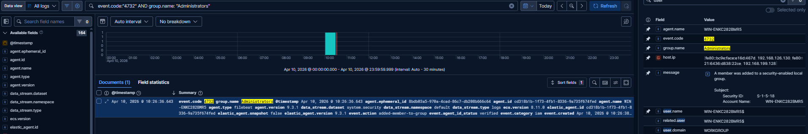
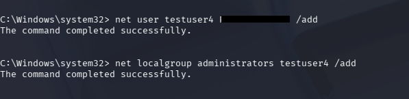
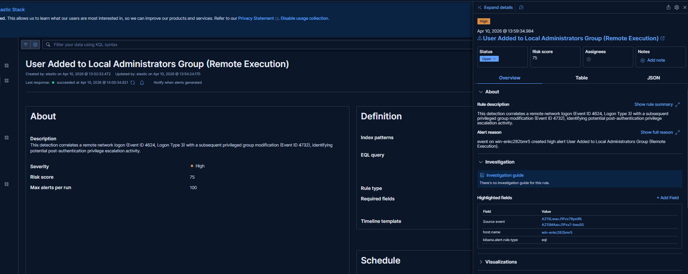

# Admin Group Modification Detection (Remote Execution via Impacket)

---

## **Overview**

This project demonstrates the detection of a privilege escalation scenario in which a user is added to the local Administrators group on a Windows system through remote command execution.

The attack is performed from a Kali Linux machine using Impacket, simulating a real-world post-compromise scenario where an attacker leverages valid credentials to escalate privileges without direct interactive access to the target host.

The detection is implemented in Elastic Security using both single-event logic and multi-event correlation, enabling identification of the behavior as part of a broader attack chain rather than as an isolated action.

---

## **Objective**

The objective of this project is to simulate a realistic privilege escalation technique and build a detection that identifies the behavior using Windows Security logs.

This includes generating the attack, validating the resulting telemetry, creating detection rules, and confirming that alerts are triggered within the Security Operations Center workflow.

---

## **Lab Environment**

The lab environment consists of multiple systems that work together to simulate attacker activity and defensive monitoring.

A Kali Linux machine is used as the attacker system, executing remote commands using Impacket. A Windows endpoint serves as the target system where the privilege escalation occurs. Elastic Stack is used for log ingestion, analysis, and detection. An alerting pipeline using n8n, Gmail, and osTicket is used to simulate incident response and ticket creation.

---

## **Attack Scenario**

The attack simulates a situation where an attacker has obtained valid credentials and uses them to remotely execute commands on a Windows host.

Using Impacket’s wmiexec module, the attacker creates a user account and adds it to the local Administrators group. This results in a privilege escalation event that grants elevated access to the system.

This technique is commonly used by attackers to establish persistence and expand control within a compromised environment.

---

## **Attack Execution**

The attack is executed remotely from the Kali machine using Impacket.

```bash
impacket-wmiexec username:password@TARGET_IP "net user testuser2 Password123! /add"
```
---

## **Log Generation**

The attack generates Windows Security events that are ingested into Elastic.

Event ID 4624 is generated for the remote network logon, specifically Logon Type 3, indicating authentication over the network. Event ID 4732 is generated when the user is added to the local Administrators group.

These logs provide the foundation for building detection logic.

---

## **Detection Strategy**

The detection strategy focuses on identifying privilege escalation through group membership changes.

A basic detection can be implemented using a single event, specifically Event ID 4732, which indicates that a user has been added to a security-enabled local group.

A more advanced detection correlates the remote logon event with the subsequent group modification, allowing identification of suspicious behavior across multiple stages of the attack.

---

## **KQL Detection**

```kql
event.code:4732 and group.name:"Administrators"
```
---

## **EQL Correlation Detection**

```eql
sequence by host.name with maxspan=5m
  [any where event.code == "4624" and winlog.logon.type == "3"]
  [any where event.code == "4732" and group.name == "Administrators"]
```
This detection correlates a remote network logon with a subsequent privilege escalation, identifying potential attacker activity rather than isolated events.

## **Detection Logic**

The detection identifies when a user is added to the local Administrators group, which represents a high-impact privilege escalation.

By correlating this activity with a preceding remote logon, the detection captures behavior consistent with an attacker using valid credentials to gain elevated access.

This behavior-based approach improves detection fidelity and reduces reliance on static indicators.

## **MITRE ATT&CK Mapping**

T1078 – Valid Accounts
T1098 – Account Manipulation

## **Validation**

The detection is validated by executing the attack and confirming that logs are generated and alerts are triggered within Elastic Security.

The user is removed and re-added to the Administrators group to ensure that fresh events are generated during testing. Alerts are reviewed to confirm that they accurately reflect the detected activity.


## **Screenshots**







---

## **Key Insight**

The privilege escalation was performed remotely using Impacket, demonstrating how attackers can modify group membership without direct interactive access to a system.

Detection is therefore based on Windows Security logs rather than process execution visibility, highlighting the importance of monitoring identity and access changes.

## **Conclusion**

This project demonstrates how a common privilege escalation technique can be detected using log-based analysis and event correlation.

By combining attack simulation with detection engineering, this lab provides a realistic representation of how Security Operations Centers identify and respond to threats.
